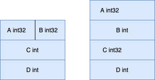

## Golang字段对齐

**结论：**对于Golang的struct，不同的排列会产生不一样的大小。

**现象：**

```go
type F struct {
	A int32
	B int32
	C int
	D int
}
```

对于这个结构体，它的大小为24 bytes

而同样的类似结构

```go
type F struct {
	A int32
	B int
	C int32
	D int
}
```

它的大小却为32。

**原因：**

在64位操作系统下，go没有对struct结构体做优化，导致如下情况：



**备注：**

在Go1.14.2 和 64位操作系统下